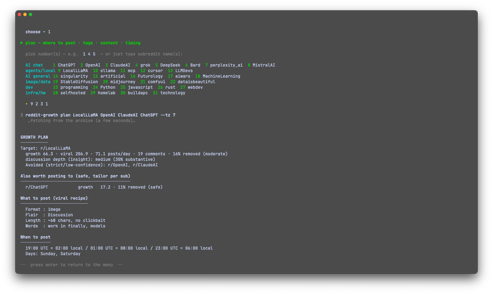
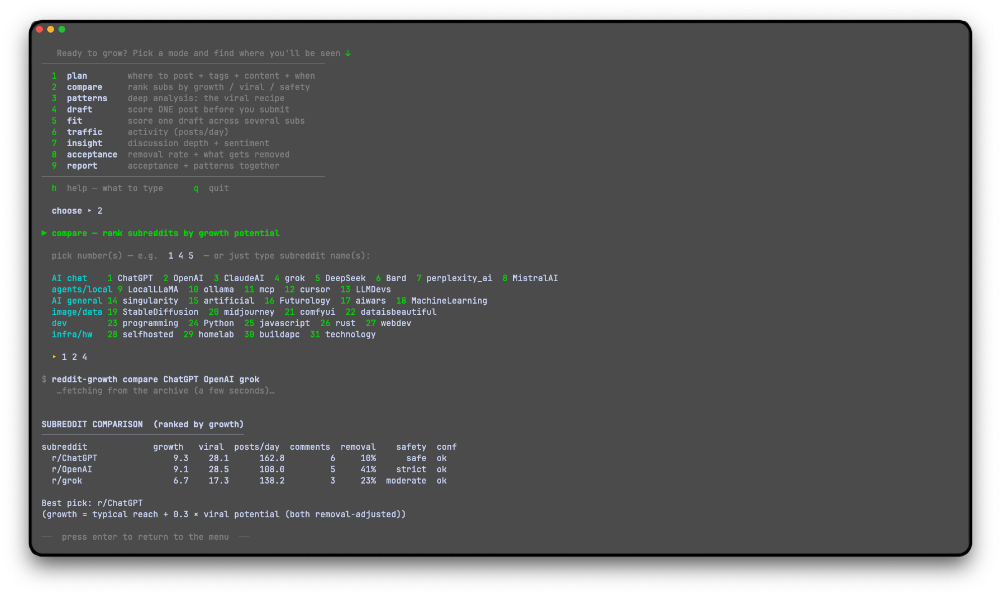
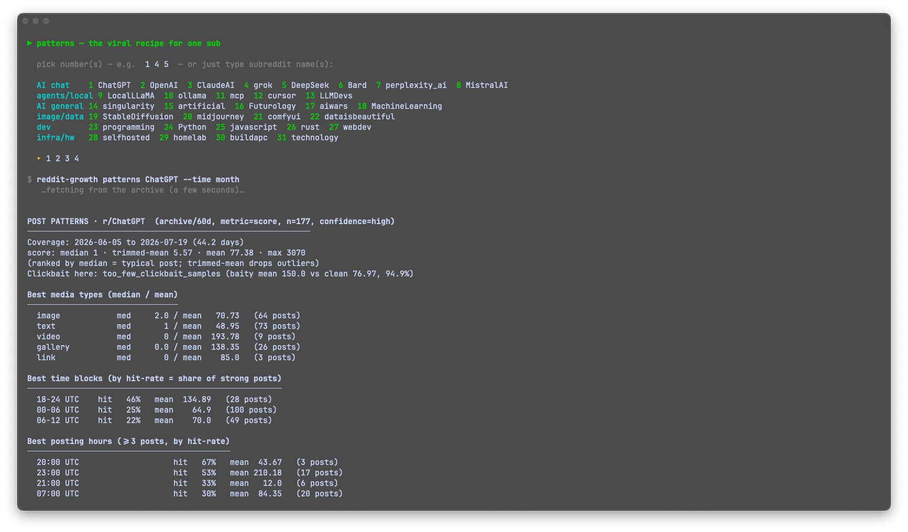
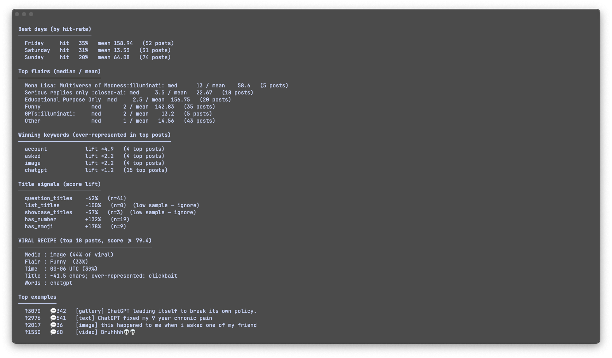

<p align="center">
  
</p>

<h1 align="center">Reddit Growth MCP</h1>

[](https://pypi.org/project/reddit-growth-mcp/)
[](https://github.com/latent-9/reddit-growth-mcp/actions/workflows/ci.yml)
[](LICENSE)

A toolkit for analyzing subreddits and the patterns behind posts that get
accepted and perform well. It helps you choose the right communities and shape
posts that fit each one, using real data rather than guesswork.

It runs as an MCP server (for use inside Claude, Cursor, and other MCP clients)
and as a standalone command-line tool. Most analysis works without any Reddit
API credentials, because it reads from a public historical archive.

<p align="center">
  
</p>

One command turns a list of subreddits into a plan — where to post, what to
post, and when:

```text
$ reddit-growth plan singularity LocalLLaMA mcp --tz 7

GROWTH PLAN
Target: r/singularity
  growth 222.9 · viral 629.1 · 48 posts/day · 23 comments · 12% removed (safe)
  discussion depth (insight): medium (30% substantive)

Also worth posting to (safe, tailor per sub)
  r/LocalLLaMA   growth 64.3 · 12% removed (safe)

What to post (viral recipe)
  Format : image      Flair : AI      Length : ~97 chars, no clickbait
  Words  : open, kimi, deepseek

When to post
  08:00 UTC = 15:00 local / 15:00 UTC = 22:00 local   ·   Days: Friday, Saturday
```

## Quick start

Requirements: Python 3.11+ and [uv](https://docs.astral.sh/uv/). No Reddit
account or API keys are needed to get started.

Install from PyPI:

```bash
uvx reddit-growth-mcp                            # run the MCP server instantly
pipx install reddit-growth-mcp                   # or install the CLI + server
reddit-growth plan singularity LocalLLaMA mcp    # your first growth plan
```

Or from a clone (for development):

```bash
uv sync                                                    # install dependencies
uv run python -m src.cli plan singularity LocalLLaMA mcp   # your first growth plan
```

That prints where to post, what to post, and when — using only the public
archive. Every command has the form `uv run python -m src.cli <command> [options]`
(shown throughout as `reddit-growth <command>`, which is the installed alias).
Add `-h` to any command for help, e.g. `uv run python -m src.cli plan -h`.

### Interactive launcher

Prefer a menu to flags? Run:

```bash
bash scripts/menu.sh
```

Pick a mode (plan, compare, patterns, draft, …), choose subreddits by number
from a preset list (or type your own), and it runs the command for you — all in
one window, looping until you quit. Type `h` in the menu for a built-in guide.

## What it answers

- Which subreddits fit my topic, and how much reach do they have?
- Will my post survive here, or does this community remove a lot of posts?
- What actually performs here: which format, title style, timing, and flair?
- Given a specific draft, how is it likely to do, and how do I improve it?

## Demo

The interactive launcher (`bash scripts/menu.sh`) — pick a mode, choose
subreddits by number, and it runs the analysis for you:

**`plan` — where to post, the tags and content to use, and when**



**`compare` — rank candidate subreddits by growth potential**



**`patterns` — the full viral recipe for a subreddit**




## Tools

| Tool | Purpose | Needs credentials |
| --- | --- | --- |
| `analyze_post_patterns` | What performs in a sub: timing, media, title style, flair, keywords, by a configurable metric | No |
| `analyze_acceptance` | Removal rate and what tends to get removed; official rules when credentials are present | No |
| `compare_subreddits` | Rank subreddits by growth (typical reach + viral upside), with traffic (posts/day), discussion, removal risk, and a safety label; `rank_by` switches to viral/opportunity/insight | No |
| `analyze_insight` | Discussion depth (comment substance) plus a heuristic sentiment read (supportive/mixed/critical) — not just comment count | No |
| `growth_plan` | One call: safest strong target, cross-post options, viral recipe, and best posting times | No |
| `evaluate_draft` | Predict a draft's performance (0-100) and acceptance risk, with drivers and fixes | No |
| `evaluate_draft_across` | Score one draft across subs, ranked by size-fair fit (percentile) vs raw reach | No |
| `analyze_subreddit` | Estimate a subreddit's activity (posts/day); uses the archive without credentials | No |
| `find_target_subreddits_tool` | Discover and rank subreddits for topics by estimated traffic | Yes |
| `fetch_posts`, `fetch_multiple`, `search_subreddit`, `fetch_comments` | Raw data access | Yes |

The analysis tools are subreddit-agnostic. They have been exercised on
communities such as `Fedora`, `gnome`, `linux`, `commandline`, `mcp`,
`LocalLLaMA`, and `ClaudeAI`.

## Data sources

- PRAW for live Reddit access (read-only). Requires API credentials.
- Arctic Shift (https://github.com/ArthurHeitmann/arctic_shift), a public
  historical archive and the successor to Pushshift. Requires no credentials.

Removal detection follows the reveddit approach: the archive records what was
posted, and moderator removals are read from that record. When Reddit
credentials are available, `analyze_acceptance` performs an accurate live diff
(archive vs. current Reddit) to resolve ambiguous cases; without credentials it
runs archive-only and flags its confidence.

## Installation

```bash
uv sync
```

Reddit credentials are optional. They unlock the credential-only tools and the
accurate live removal check. Create a "script" application at
https://www.reddit.com/prefs/apps, then:

```bash
cp .env.sample .env
# REDDIT_CLIENT_ID=...
# REDDIT_CLIENT_SECRET=...
# REDDIT_USER_AGENT=reddit-growth-mcp/0.1 by u/your_username
```

Without credentials, the pattern, acceptance, comparison, and draft tools still
work via the archive.

## Command-line usage

Every command runs credential-free from the archive. The commands are:
`traffic`, `insight`, `patterns`, `acceptance`, `compare`, `plan`, `report`,
`draft`, and `fit` (run `-h` on any of them for options).

```bash
uv run python -m src.cli traffic LocalLLaMA
uv run python -m src.cli insight mcp
uv run python -m src.cli patterns Fedora --time month
uv run python -m src.cli patterns commandline --metric discussion
uv run python -m src.cli acceptance technology
uv run python -m src.cli compare Fedora gnome linux
uv run python -m src.cli plan singularity LocalLLaMA mcp --tz 7
uv run python -m src.cli draft ClaudeAI --title "I built an ASCII art tool" --type image
uv run python -m src.cli fit singularity LocalLLaMA mcp --title "..." --type video
```

`fit` scores one draft across several subreddits and ranks by a size-fair fit
(the draft's percentile within each sub's own score distribution) alongside raw
expected reach, so a small sub where the post lands in the top decile isn't
buried by a big sub's larger absolute numbers.

Add `--json` to any command for raw output.

`patterns` accepts `--metric`:

- `score`: upvotes (reach).
- `comments`: comment volume.
- `discussion`: comments per upvote, a proxy for genuine engagement rather than
  drive-by upvotes.
- `quality`: upvotes damped by a clickbait penalty.

## Example analysis

Ranking a set of AI/dev communities for account growth (credential-free):

```
$ reddit-growth compare singularity LocalLLaMA unixporn linux mcp --window 30d

SUBREDDIT COMPARISON  (ranked by growth)
subreddit             growth   viral  posts/day  comments  removal    safety  conf
  r/singularity         222.9   629.1       48.7        22     12%      safe  ok
  r/LocalLLaMA           64.3   199.8       80.2        19     12%      safe  ok
  r/unixporn             53.4   120.0       38.5         2     28%  moderate  ok
  r/linux                12.8    42.6       60.9        10     55%    strict  ok
  r/mcp                   1.5     2.8       45.6         1     30%  moderate  ok
```

Reading it: r/singularity and r/LocalLLaMA are safe (low removal) and active,
with high viral ceilings and real discussion; r/linux is active but strict
(55% of posts removed). Turning that into a plan:

```
$ reddit-growth plan singularity LocalLLaMA unixporn mcp --tz 7

GROWTH PLAN
Target: r/singularity
  growth 222.9 · viral 629.1 · 48.7 posts/day · 22 comments · 12% removed (safe)

Also worth posting to (safe, tailor per sub)
  r/LocalLLaMA   growth 64.3 · 12% removed (safe)
  r/unixporn     growth 53.4 · 28% removed (moderate)

What to post (viral recipe)
  Format : link
  Flair  : AI
  Length : ~97.5 chars, no clickbait

When to post
  08:00 UTC = 15:00 local / 15:00 UTC = 22:00 local
  Days: Saturday, Friday
```

Figures are estimates from a sample and will shift over time; run it live for
current numbers.

## Use as an MCP server

Register the server once (Claude Code shown):

```bash
claude mcp add reddit-growth-mcp -- uvx reddit-growth-mcp
```

For Cline, Cursor, Claude Desktop, and other clients, add it to the MCP
settings JSON (no separate install — `uvx` fetches it from PyPI):

```json
{
  "mcpServers": {
    "reddit-growth": {
      "command": "uvx",
      "args": ["reddit-growth-mcp"]
    }
  }
}
```

Then ask in natural language, for example "analyze what performs in r/Fedora"
or "will this title get accepted in r/linux?" The client calls the tools.

For the full flow in one step, ask for a growth plan ("build a growth plan for
r/singularity, r/LocalLLaMA, r/mcp") to invoke `growth_plan`, or select the
`reddit_growth` prompt, which guides the assistant through finding a safe
high-traffic subreddit and crafting a post that fits its viral recipe.

To run the server directly over stdio:

```bash
uv run python -m src.server
```

### Docker

The server also ships as a container (stdio transport):

```bash
docker build -t reddit-growth-mcp .
docker run -i --rm reddit-growth-mcp
# with credentials:
docker run -i --rm -e REDDIT_CLIENT_ID=... -e REDDIT_CLIENT_SECRET=... reddit-growth-mcp
```

## Targeting workflow

To find where to post for growth, `compare_subreddits` reports, per subreddit:

- viral potential (90th-percentile reach adjusted for removal risk) and ceiling,
- posts per day (a credential-free traffic proxy),
- typical discussion (median comments),
- removal rate and a safety label (safe / moderate / strict), so you can avoid
  communities that remove most posts.

A typical flow: `compare` to shortlist safe, high-traffic, high-ceiling subs,
then `patterns` to read the viral recipe, then `evaluate_draft` to score a draft
against it before posting.

Reach and insight are different goals. `compare` counts comments (volume);
`analyze_insight` measures their *depth* — median comment length and the share
of substantive comments. A sub can have many short one-line replies (high volume,
low insight) or fewer long technical comments (low volume, high insight). Use
reach-oriented ranking for visibility, and `analyze_insight` to find where
thoughtful discussion happens and reputation is built.

## Accuracy and methodology

The tool is built to avoid the common failure modes of naive Reddit analytics.

- Robust central tendency. Categories (media, flair, time) are ranked by the
  median, with the mean shown for reference, so a single viral post cannot crown
  a category.
- Minimum-sample gating. A category or time bucket must contain enough posts to
  be reported as "best". Small buckets are not treated as reliable signals, and
  draft scoring ignores title signals whose with/without groups are too small,
  so a single lucky post cannot swing a projection or seed a bogus suggestion.
- Confidence labelling. Each pattern report states a confidence level based on
  its sample size, and each acceptance report states a reliability level.
- Settled scores. Archived scores stabilise after roughly 36 hours, so analysis
  excludes the most recent two days.
- AutoMod awareness. Posts that were only AutoMod-filtered at capture time are
  treated as uncertain, not confirmed removals, because they are frequently
  approved later. On AutoMod-heavy subreddits this is flagged, and an accurate
  live check requires credentials.
- Removal-aware verdicts. A draft's acceptance verdict folds in the sub's base
  removal rate, so a compliant post in a subreddit that removes most of what it
  gets is flagged risky rather than "likely accepted".
- Anti-clickbait. Clickbait titles are detected (hype phrases, shouted words,
  emoji and punctuation spam), and each report states whether the community
  actually rewards or penalises clickbait, so guidance never pushes you toward
  it. `evaluate_draft` penalises a clickbaity draft only where the sub dislikes
  it.

## Limitations

- Traffic figures are estimates. Reddit does not expose true daily visitor
  counts through its public API.
- Findings are correlations from a sample, not Reddit's ranking algorithm and
  not a guarantee of performance.
- AutoModerator configuration is private. Karma and account-age gates are
  inferred from rule text and require credentials to read.

## Development

```bash
uv sync --extra dev
uv run pytest -q                       # tests
uv run ruff check src tests            # lint
uv run ruff format src tests           # format
```

CI runs the lint, format check, and tests on every push and pull request.

The analysis logic lives in `src/analysis/` (traffic, acceptance, patterns,
draft, compare, arctic, helpers). The MCP surface is `src/server.py` and the
CLI is `src/cli.py`.

## License

MIT
